# Oasis Infobyte Internship - Level 2 Tasks

Welcome to my repository for Oasis Infobyte's Level 2 internship tasks. In this level, I have chosen Level 2 and completed the following tasks:

1. [Task 1 - Calculator](https://github.com/patilmanas04/OIBSIP/tree/main/Level%202/oibsip_taskno_1)
2. [Task 2 - Page for Someone I Admire](https://github.com/patilmanas04/OIBSIP/tree/main/Level%202/oibsip_taskno_2)
3. [Task 3 - To-Do App](https://github.com/patilmanas04/OIBSIP/tree/main/Level%202/oibsip_taskno_3)
4. [Task 4 - Login Authentication System](https://github.com/patilmanas04/OIBSIP/tree/main/Level%202/oibsip_taskno_4)

---

## Task 1 - Calculator

It takes a little skill to create a calculator with basic mathematical functionalities using CSS, HTML, and JavaScript. Calculators require an interactive interface to perform basic functions such as addition, subtraction, division, and multiplication. The grid system in CSS is for the alignments of buttons on the calculator. The additional tools you need to build a fully functional calculator include eventListeners, if-else statements, operators, loops, and so on.

### Screenshots

*Calculatar Screenshot (Light Mode)*

*Calculatar Screenshot (Dark Mode)*
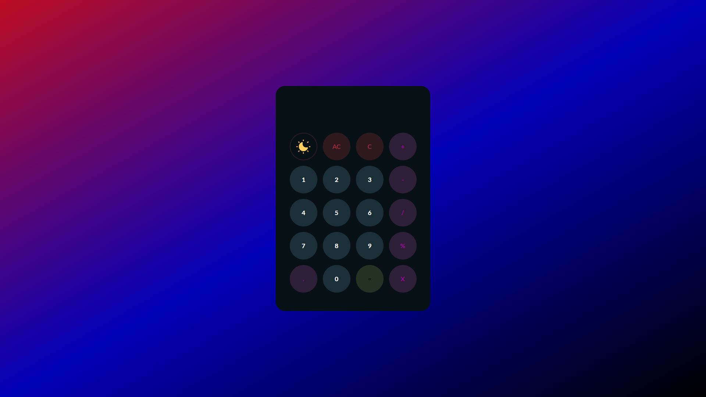

---

## Task 2 - Page for Someone I Admire

With a basic understanding of HTML and CSS, you can easily create a page for someone you admire. Write about what you adore in the person, add images, give an appealing layout, use paragraphs appropriately. You can also play around with different font styles and background colors.

### Screenshots

*Admire Page screenshot*
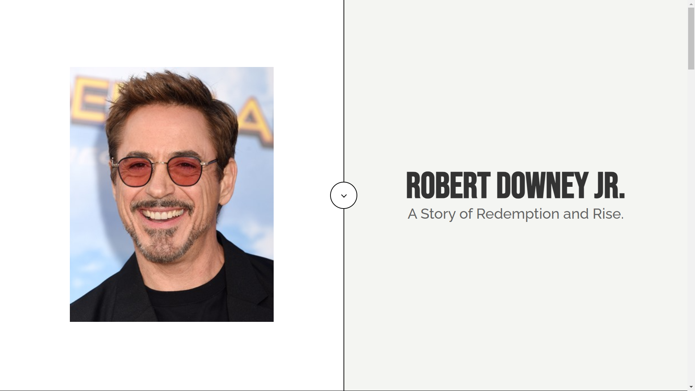

*Admire Page screenshot*

*Admire Page screenshot*
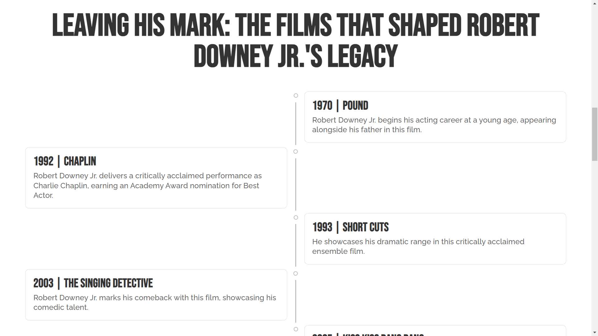

*Admire Page screenshot*
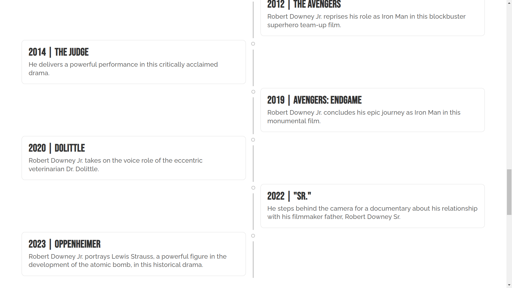

*Admire Page screenshot*

---

## Task 3 - To-Do App

Develop a basic to-do app that enables a user to add daily tasks. The to-do web app must allow users to add new items to a list, and items added to a list must be visible. Also, a user can mark a task "complete" upon its successful completion, and these completed tasks must appear on a separate list, say Completed Tasks. You can also add a separate section titled Pending Tasks that will list all the tasks that require completion. In such a case, the to-do list will be a union of the Pending Tasks list and the Completed Tasks list. Irrespective of the list, a user must be able to delete or edit tasks from it. To further increase the web app's complexity or make it more detailed, you can add the date and time when a task is added and/or completed.

### Screenshots

*To-Do App Screenshot*
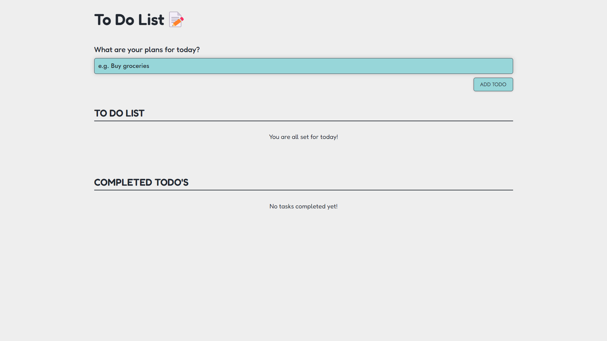

*To-Do App Screenshot*
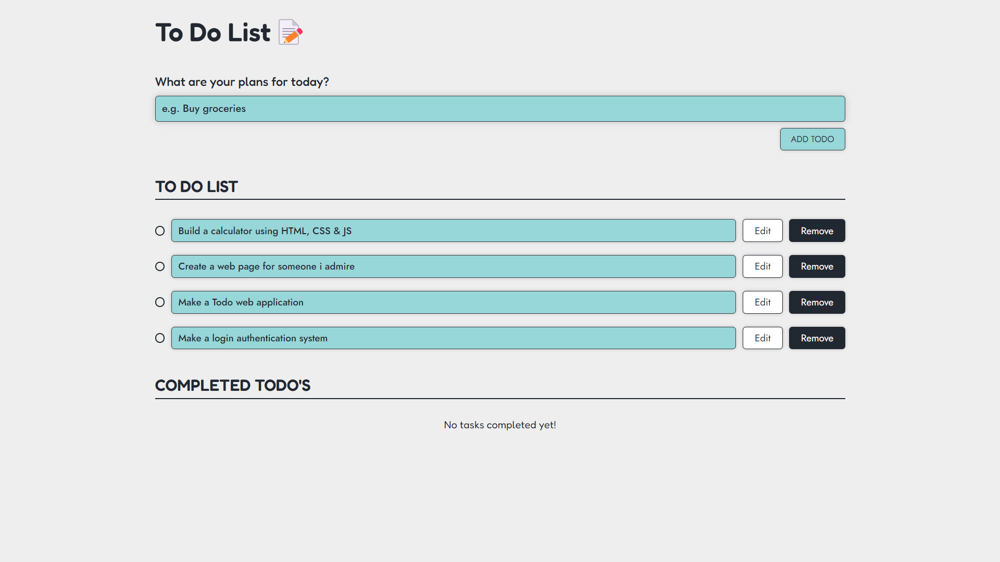

*To-Do App Screenshot*
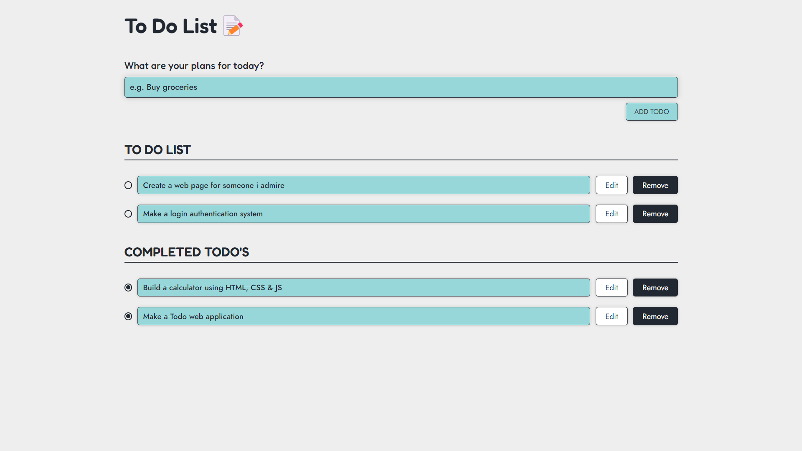

*To-Do App Screenshot*
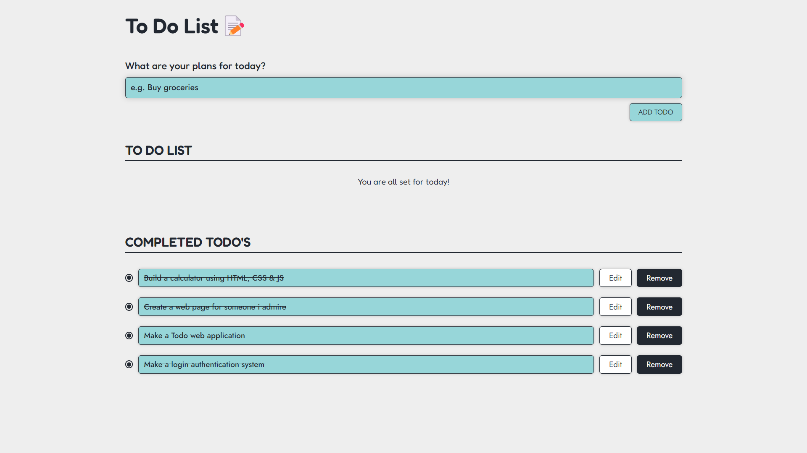

---

## Task 4 - Login Authentication System

Create a simple login authentication system using a programming language of your choice (e.g., Python, JavaScript, Java, etc.) that allows users to register, login, and access a secured page.

### Screenshots

*Signup Page screenshot*
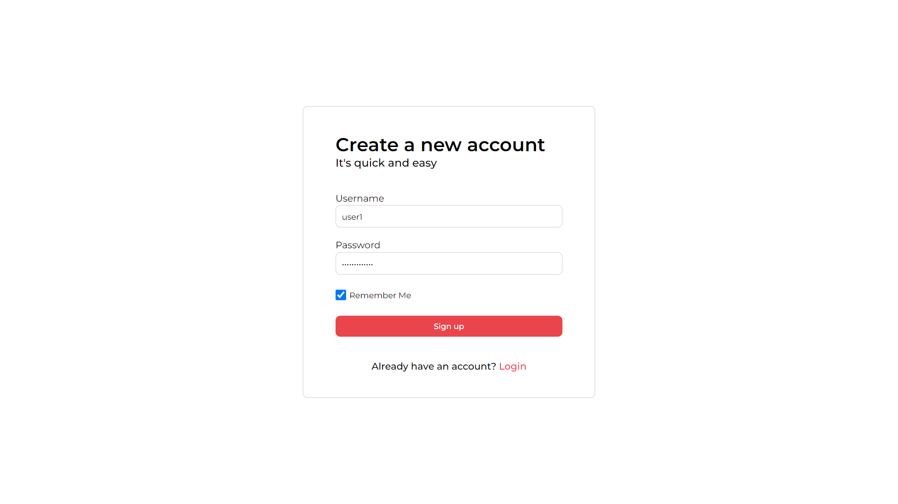

*Login Page screenshot*
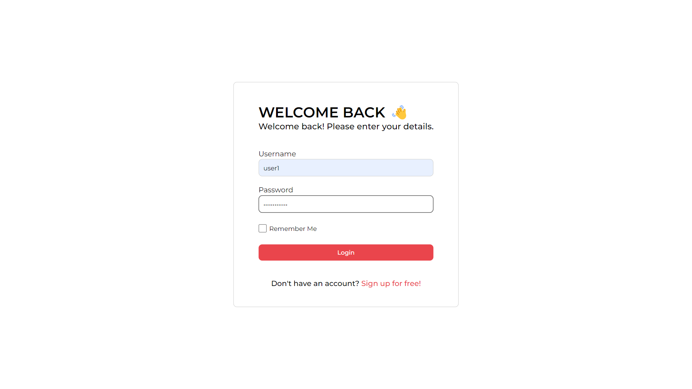

*Secured Page screenshot*
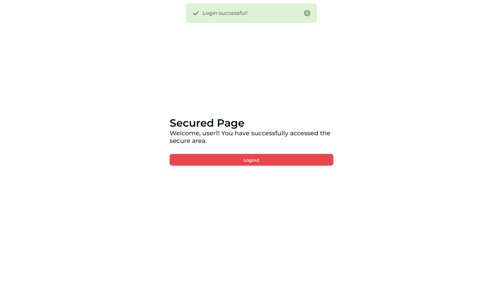

*MongoDB database screenshot*
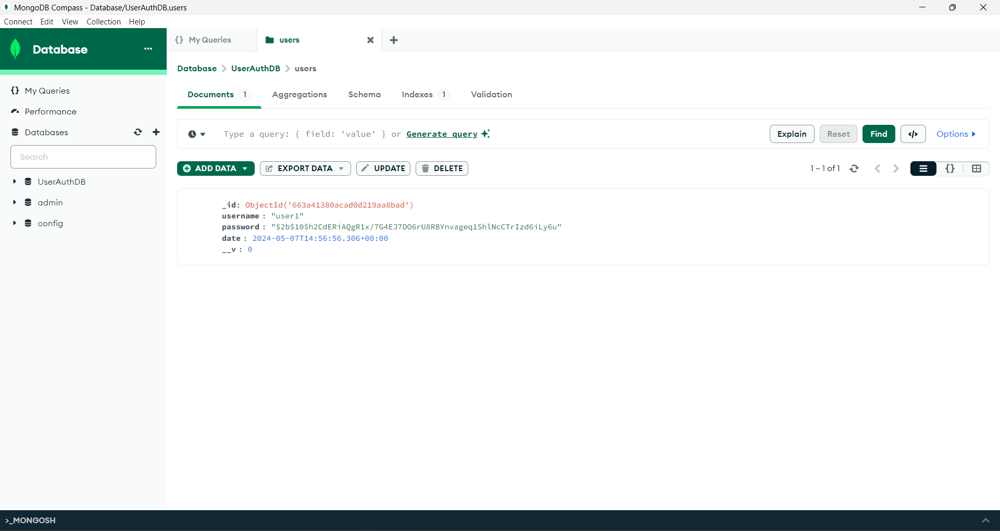

---

Feel free to explore each task's folder in this repository for the source code, documentation, and any additional notes related to each task.
